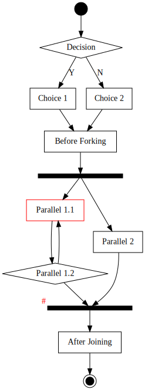

# Fountainedge

**NOTICE: VERSION 0.1 to VERSION 1.0 UPGRADE HAS BREAKING API CHANGES**

----

**Fountainedge** is a simple workflow engine written in [Elixir](https://elixir-lang.org/) that roughly models forks and joins as described in the paper, *[Process Modeling Notations and
Workflow Patterns](https://github.com/emden-norfolk/fountainedge/raw/master/BPMN_wfh.pdf) by Stephen A. White, IBM Corporation*. 
Uses [Graphviz](https://graphviz.org/) for graphical representations as [UML](https://www.omg.org/spec/UML/) Activity Diagrams.

 * [Hex Package](https://hex.pm/packages/fountainedge)
 * [Documentation](https://hexdocs.pm/fountainedge)

The workflow is modelled as graphs consisting of nodes and edges. Parallel forks and joins are tracked using tokens.

## Example



Define a schema:

```elixir
schema = %Fountainedge.Schema{
  nodes: [
	%Fountainedge.Node{id: 1, label: "Initial", type: :initial},
	%Fountainedge.Node{id: 2, label: "Choice 1"},
	%Fountainedge.Node{id: 3, label: "Choice 2"},
	%Fountainedge.Node{id: 4, label: "Before Forking"},
	%Fountainedge.Node{id: 5, type: :fork},
	%Fountainedge.Node{id: 6, label: "Parallel 1.1"},
	%Fountainedge.Node{id: 7, label: "Parallel 1.2"},
	%Fountainedge.Node{id: 8, label: "Parallel 2"},
	%Fountainedge.Node{id: 9, type: :join},
	%Fountainedge.Node{id: 10, label: "After Joining"},
	%Fountainedge.Node{id: 11, label: "Final", type: :final},
  ],
  edges: [
	%Fountainedge.Edge{id: 1, next: 2}, 
	%Fountainedge.Edge{id: 1, next: 3}, 
	%Fountainedge.Edge{id: 2, next: 4}, 
	%Fountainedge.Edge{id: 3, next: 4}, 
	%Fountainedge.Edge{id: 4, next: 5}, 
	%Fountainedge.Edge{id: 5, next: 6}, 
	%Fountainedge.Edge{id: 5, next: 8}, 
	%Fountainedge.Edge{id: 6, next: 7}, 
	%Fountainedge.Edge{id: 7, next: 6}, 
	%Fountainedge.Edge{id: 7, next: 9}, 
	%Fountainedge.Edge{id: 8, next: 9}, 
	%Fountainedge.Edge{id: 9, next: 10},
	%Fountainedge.Edge{id: 10, next: 11},
  ],  
}   
```

Initialise the workflow:

```elixir
workflow = Fountainedge.Workflow.initialize(schema)
```

Get a list of valid out edges:

```elixir
Fountainedge.out_edges(workflow)
# [%Fountainedge.Edge{id: 1, next: 2}]
```

Transition along an out edge:

```elixir
workflow = Fountainedge.transition(workflow, %Fountainedge.Edge{id: 1, next: 2})
```

Graphing:

```elixir
Fountainedge.Graph.graph(workflow)
|> Graphvix.Graph.compile(filename, :svg)
```

## Installation

This package can be installed by adding `fountainedge` to your list of dependencies in `mix.exs`:

```elixir
def deps do
  [
    {:fountainedge, "~> 1.0.0"}
  ]
end
```

## Author

2019 (c) Damien Bezborodov
